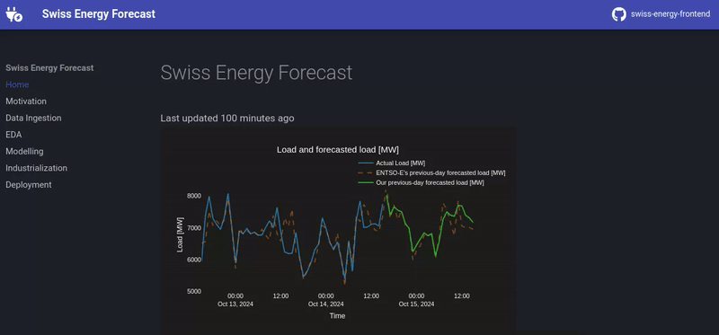

# swissenergy-frontend

🚀 <a href="https://swissenergy.arthurgassner.ch"><strong>live website</strong></a> 🚀

 

This repo contains the frontend of the [`https://swissenergy.arthurgassner.ch`]() website, showcasing an end-to-end ML solution in the energy industry with a dashboard and detailed walk-through all stages of the ML engineering work -- from problem understanding to deployment.

> [!NOTE]  
> The code for the backend can be found [here](https://github.com/arthurgassner/swissenergy-backend).