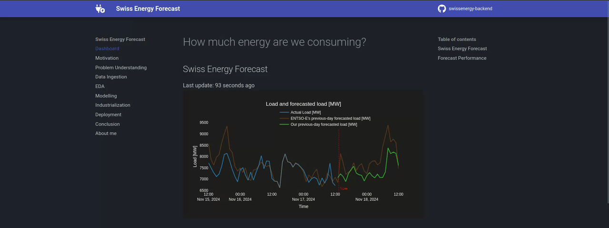

# swissenergy-frontend

> 
🚀 <a href="https://swissenergy.arthurgassner.ch"><strong>live website</strong></a> 🚀

> An End-to-End Machine Learning project built off the Swiss energy consumption data.

This repo contains the frontend of the [`https://swissenergy.arthurgassner.ch`]() website, showcasing an end-to-end ML solution in the energy industry with a dashboard and detailed walk-through all stages of the ML engineering work -- from problem understanding to deployment.

