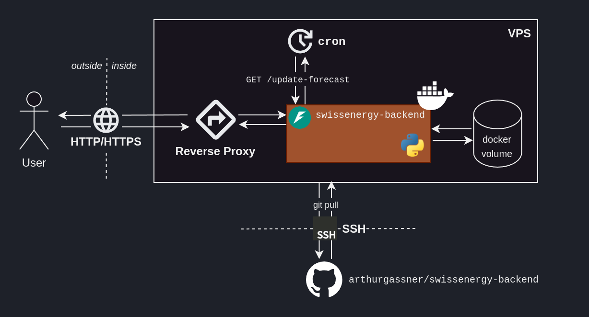

# Conclusion

## Conclusion

<figure markdown="span">
  { width="100%" }
  <figcaption>Our final ML solution.</figcaption>
</figure>

Building this side-project, I kept going back and improving things I had built in previous steps.

This iterative approach is normal, and fundamental to the ML engineering work.

!!! tip "ML engineering is iterative."
    I wrote these sections as if the ML engineering work was made out of distinct sections, where each section could be finished before going onto the next one.

    This is not the case. Working on a section will reveal opportunities -- and flaws -- in the approach taken previous sections.
    This is due to the unique context of each problem.

    It is generally a good idea not to try everything, and instead focusing on advancing onto the next section.

<figure markdown="span">
  { width="100%" }
  <figcaption>ML engineering is an iterative process.</figcaption>
</figure>

Despite this nature, an unused ML solution is a failed ML solution.  
Hence, we must deliver something. As such, this page serves as a summary of potential next steps.

## Potential future work

### Data ingestion 

- We only considered the `ENTSO-E` data and noticed their reported `Actual Load` gets updated within 1-2 weeks. How about leveraging other energy data sources? 
- We predicted future energy data from past energy data. The weather is likely a strong predictor of energy consumptino. How about enriching our model with weather data -- e.g. from MeteoSuisse?

### Modelling

- We focused on an LGBM-based approach from the get-go. How about exploring other models?
- We selected our features by intuition. How about approaching feature selection -- and model selection -- in a more methodical and scientific manner, e.g. with `SHAP` and `optuna`?

### Industrialization

- Our testing strategy focused on unit tests. How about implementing integration tests? How about testing the generated Docker image?
- Past models are not kept track of. How about tracking the training performance through MLOps tools, e.g. with `MLflow`.

### Deployment

- To update the server, we manually SSH into it, pull from the repo, build the new Docker container and start it. How about automating this process, leveraging the `Docker Hub`, or `GitHub Webhooks`?

## Conclusion

TODO
