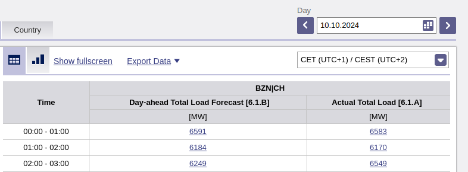
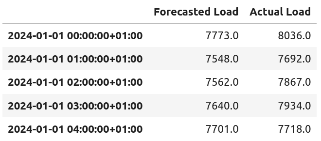

# :material-pipe: Data Ingestion

Now that we have a better understanding our business problem, we can start the first step towards a solution: getting the data.

## Our data source: ENTSO-E

The [European Network of Transmission System Operators](https://www.entsoe.eu/) represents 40 electrcity transmission system operators from 36 countries across Europe. They are one of the main data sources cited by the Swiss Energy Dashboard's [website](https://energiedashboard.admin.ch/strom/stromverbrauch), and checking their website shows that they make available -- amongst other things -- the actual load (hourly in MW) for Switzerland.

<figure markdown="span">
  { width="100%" }
  <figcaption>Hourly actual and forecasted load [MW] for Switzerland, as seen on the ENTSO-E website</figcaption>
</figure>

We'll start building our solution on this data source.
To do this, we need a way to access their entire hourly load history.

As it turns out, they have a [RESTful API](https://transparency.entsoe.eu/content/static_content/Static%20content/web%20api/Guide.html), greatly faciliting the task of ingesting this data sources -- i.e. plugging into our system so that we can use it. Before diving into learning their API, I checked if a Python client existed -- and it did: the `entsoe-py` library, open-sourced on [GitHub](https://github.com/EnergieID/entsoe-py).[^1]


!!! tip "Don't reinvent the wheel[^2]"
    Check if someone has already build what you need.

    If appropriate, use it.

To check we can access the data, let's load -- using the `entsoe-py` library -- the actual load and forecasted load for the first day of 2024:

```python
from entsoe import EntsoePandasClient
import pandas as pd

entsoe_client = EntsoePandasClient(api_key="<ENTSOE_API_KEY_HERE>")

df = entsoe_client.query_load_and_forecast(
    country_code="CH", 
    start=pd.Timestamp('2024-01-01 00:00', tz="Europe/Zurich"), 
    end=pd.Timestamp('2024-01-02 00:00', tz="Europe/Zurich"),
)
df.head(5)
```

And _voilà!_, the data is available[^3] to us:

<figure markdown="span">
  { width="100%" }
  <figcaption>First 5 rows of the actual and forecasted load [MW] for Switzerland for the 1st day of 2024, as fetched by the <code>entsoe-py</code> library</figcaption>
</figure>


[^1]: Thank you `EnergieID` for your work.

[^2]: It is quite unlikely you are the first person needing that wheel. The previous people having needed that wheel likely stumbled upon -- and solved -- problems you cannot yet envision. Building off their work, even if not _exactly_ what you had in mind, will likely win you time.

[^3]: Naturally, we check if the data retrieved through this 3rd-party client matches the data found on the ENTSO-E official website.