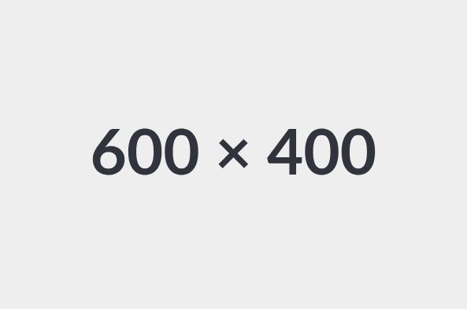

# :octicons-share-android-16: Deployment

## Introduction

We now have a maintainable end-to-end solution, that no one can use -- unless they physically access our computer.

In this section, we'll see how to deploy an ML solution so that our user can consume it, without having to literally hand over our computer.

## Someone else's computer

We don't want to give our user physical access to our computer, so how about renting someone else's computer and giving our user access to that computer instead? 

That's where cloud computing comes in.

One way to go about it would be to go on our Azure, AWS or GCP platform and setup a ressource to host our ML solution. What these platforms provide is convenience and scalability, but that comes at a price.

On the other end of that spectrum, we can rent a **Virtual Private Server (VPS)**[^1] and setup everything ourselves.

[^1]: It is basically a piece of physical machine. A lot bit like a _Virtual Machine (VM)_. I really like this solution because one VPS can be used in several projects. It's like having a side-project-dedicated machine.

The internet is ripe with low-cost VPS offers. I went with Infomaniak -- a Swiss-based cloud services company -- but others exist.

<figure markdown="span">
  { width="80%" }
  <figcaption>A side-project-dedicated machine for 3CHF/month.</figcaption>
</figure>

## Basic VPS setup

Getting into it -- SSH

<figure markdown="span">
  { width="100%" }
  <figcaption>Using SSH to access our VPS.</figcaption>
</figure>

Link subdomain to my VPS' IP, as it's likely static.

Install practical packages to make dealing with my vps more comfortable.

## Pull the software's latest version

Deploy keys to get my software

## Containerize with Docker

Docker to run my software in a packaged, reproducible way

Screen not to have 

## Reverse Proxy

Access from the outside: caddy

## Time-triggered automation

Cron

## Conclusion
