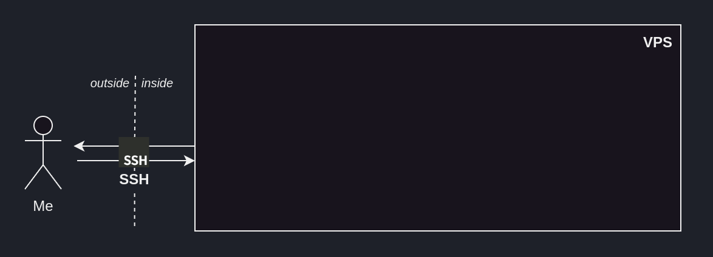

# :octicons-share-android-16: Deployment

## Introduction

We now have a maintainable end-to-end solution, that no one can use -- unless they physically access our computer.

In this section, we'll see how to deploy an ML solution so that our user can consume it, without having to literally hand over our computer.

## Someone else's computer

Back to the big picture of our ML solution, we need our code to run a remote machine, i.e. _someone's_ computer. Ideally, not us.

<figure markdown="span">
  { width="90%" }
  <figcaption>Big picture of our ML solution's system design</figcaption>
</figure>

So how about renting someone else's computer, hosting our code there -- now that it's shareable -- and giving our user access to that computer? 

That's where cloud computing comes in.

One way to go about it would be to go on our Azure, AWS or GCP platform and setup a ressource to host our ML solution. What these platforms provide is convenience and scalability, but that comes at a price.

A more hands-on -- and cheaper -- way of doing this is renting a **Virtual Private Server (VPS)**[^1] and setting everything up ourselves.

[^1]: It is basically a piece of physical machine. A lot bit like a _Virtual Machine (VM)_. I really like this solution because one VPS can be used in several projects. It's like having a side-project-dedicated machine.

The internet is ripe with low-cost VPS offers. I went with Infomaniak -- a Swiss-based cloud services company -- but others exist.

<figure markdown="span">
  { width="80%" }
  <figcaption>A side-project-dedicated machine for 3CHF/month.</figcaption>
</figure>

Through the VPS-provider's website, we order an `Ubuntu 22.04.5 LTS` and -- after a few minutes of waiting -- our machine is ready. 

## Accessing the VPS

How can we access our newly-created VPS?

During the renting-out process, the VPS provider -- here Infomaniak -- gave us a private/public SSH key pair.
Knowing the private key, I can authenticate myself to our remote machine and hence access it -- through SSH -- over the internet.

```bash title="SSH into our VPS"
ssh -i ~/<PATH_TO_VPS_PRIVATE_KEY> <USER_REMOTE_MACHINE>@<IP_REMOTE_MACHINE>
```

<figure markdown="span">
  { width="100%" }
  <figcaption>Our VPS, accessible through SSH via the internet.</figcaption>
</figure>


??? note "Primer on public/private key encryption"
    Public/private key encryption is a widely-used authentification method.

    This method revolves around two "keys", i.e. long string of seemingly-random characters.

    The public key is called _public_ because its owner can share it with everyone.<br>
    The private key is called _private_ because its owner should keep it to themselves.

    Its core principle is that **data encrypted with a *public* key can _only_ be decrypted with the corresponding *private* key**.

    This means that if I encrypt some secret message with your public key -- which is public and hence wildely-available --, and you're able to decrypt it, then you _must_ have access to the corresponding private key.

    SSH -- and other protocols, like HTTPS -- rely on this property. That's how our VPS knows that I am who they say I am -- i.e. someone who's allowed in, since I have access to the private key matching their public key.

To make it more comfortable to work on our VPS, we can set it up with our favourite productivity tools, as we would with any newly-installed machine.

??? note "Setting up our remote machine"
    This step is completely up to personal preferences.

    On my end, my setting-up-the-vps flow looks like

    ```bash
    sudo apt install && sudo apt upgrade # Upgrade the installed-by-default software 
    sudo reboot

    # Install oh-my-zsh 
    sudo apt install zsh
    sudo chsh -s $(which zsh)
    sh -c "$(curl -fsSL https://raw.githubusercontent.com/ohmyzsh/ohmyzsh/master/tools/install.sh)"

    # Install fzf
    git clone --depth 1 https://github.com/junegunn/fzf.git ~/.fzf 
    ~/.fzf/install
    # Then, manuall add the below lines to ~/.zshrc to fix some fzf-related bug
    # export LC_CTYPE=en_US.UTF-8
    # export LC_ALL=en_US.UTF-8

    # Install zsh-autosuggestions
    git clone https://github.com/zsh-users/zsh-autosuggestions ${ZSH_CUSTOM:-~/.oh-my-zsh/custom}/plugins/zsh-autosuggestions
    # Then, manually add zsh-autosuggestions to ~/.zshrc's plugins
    ```

## Pull the software's latest version

How can we get our production-ready code onto our VPS?

[GitHub deploy keys](https://docs.github.com/en/authentication/connecting-to-github-with-ssh/managing-deploy-keys) address this need.
They can grant our VPS a limited access -- read-only to a single repository -- and allow us to easily cancel them in the future.

!!! note "Generating a dedicating public/private SSH key pair"
    As not to use one SSH key pair for everything, we generate a public/private SSH key pair dedicated to authentifying us to GitHub.

    To do so, follow the [`ssh-keygen` procedure](https://docs.github.com/en/authentication/connecting-to-github-with-ssh/generating-a-new-ssh-key-and-adding-it-to-the-ssh-agent#generating-a-new-ssh-key).


<figure markdown="span">
  { width="100%" }
  <figcaption>Administrating deploy keys on GitHub.</figcaption>
</figure>

!!! note "GitHub deploy keys"
    A deploy key is a public SSH key that was uploaded on GitHub, granting the owner of the matching private key with access to a single repository.
    
    That access can be read-only, or read-and-write.

<figure markdown="span">
  { width="100%" }
  <figcaption>Our VPS, now able to pull from our repo.</figcaption>
</figure>

## Containerization

How can we package our software to ensure it'll run on our VPS, since VPS' environment will differ from our development environment -- i.e. my personal computer?

Containerization addresses this issue, with tools such as [Docker](https://www.docker.com/).

Through a `Dockerfile`, we can setup reproducible steps outlining the environment within which our ML solution will live.
We rely on Docker volumes to save data accross runs of our container.

<figure markdown="span">
  { width="100%" }
  <figcaption>Our VPS, running our containerized ML solution.</figcaption>
</figure>

## Publishing our ML solution

Our ML solution is running on our VPS, and can respond to specific requests on specific routes, but not from the internet.

To enable that, we need to 
1. Make sure our VPS ports are open 

## Open the ports

## Firewall

## Reverse Proxy

Access from the outside: caddy

## HTTPS

Amazing! Now, writing out our remote machine's IP all the time can be cumbersome. As with most VPS, its public IP is static. Hence, I can assign a subdomain[^2] to it, so that anyone -- including me -- can refer to its public IP via its subdomain.

[^2]: When you own a domain -- e.g. `arthurgassner.ch` -- you can create subdomains -- e.g. `thisisasubdomain.arthurgassner.ch` -- at your will. This can come in handy.

In practice, this means going on my domain registrar's website -- in my case _GoDaddy_ -- and _adding a new DNS record_ of Type A[^3], whose name is `thisisasubdomain` pointing to my VPS's public IP..

[^3]: More informations on DNS record types can be found [here](https://en.wikipedia.org/wiki/List_of_DNS_record_types)

<figure markdown="span">
  { width="100%" }
  <figcaption>Pinging our VPS via its public IP and via its subdomain.</figcaption>
</figure>

Similarly, this now mean that we can SSH into our remote machine through said subdomain.

## Screen 

Screen not to have 

## Time-triggered automation

Cron

## Conclusion
