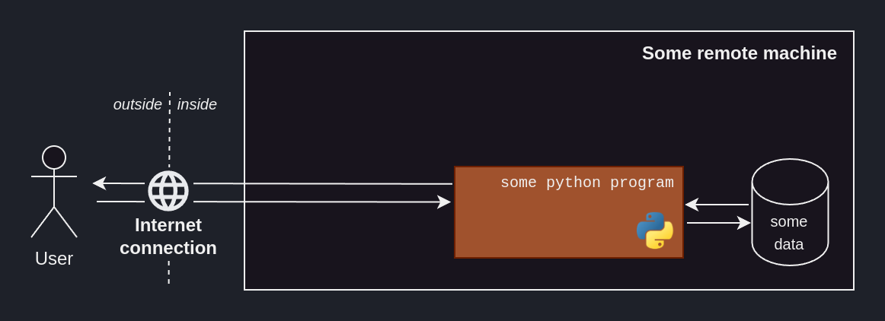
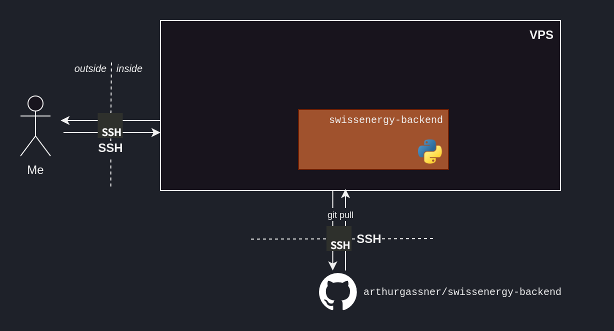
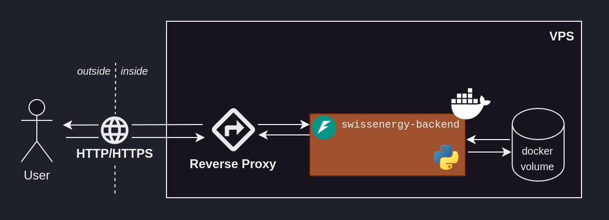
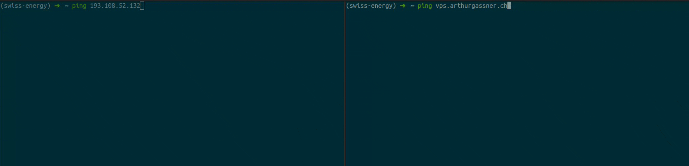
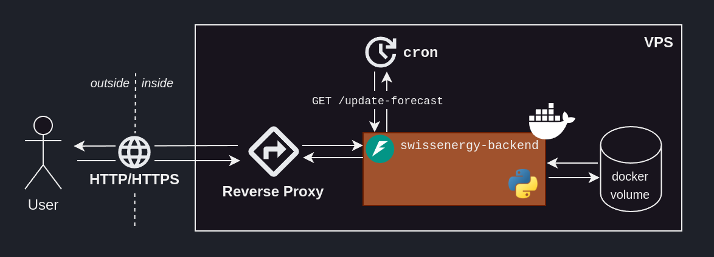

# :octicons-share-android-16: Deployment

## Introduction

We now have a maintainable end-to-end solution, that no one can use -- unless they physically access our computer.

In this section, we'll see how to deploy an ML solution so that our user can consume it, without having to literally hand over our computer.

## Someone else's computer

Back to the big picture of our ML solution, we need our code to run on a remote machine, i.e. _someone's_ computer, ideally not ours.

<figure markdown="span">
  { width="90%" }
  <figcaption>Big picture of our ML solution's system design</figcaption>
</figure>

So how about renting someone else's computer, hosting our code there -- now that it's shareable -- and giving our user access to that computer? 

That's where cloud computing comes in.

One way to go about it would be to go on our Azure, AWS or GCP platform and setup a ressource to host our ML solution. What these platforms provide is convenience and scalability, but that comes at a price.

A more hands-on -- and cheaper -- way of doing this is renting a **Virtual Private Server (VPS)**[^1] and setting everything up ourselves.

[^1]: It is basically a piece of physical machine. A lot bit like a _Virtual Machine (VM)_. I really like this solution because one VPS can be used in several projects. It's like having a side-project-dedicated machine.

The internet is ripe with low-cost VPS offers. I went with Infomaniak -- a Swiss-based cloud services company -- but others exist.

<figure markdown="span">
  { width="80%" }
  <figcaption>A side-project-dedicated machine for 3CHF/month.</figcaption>
</figure>

Through the VPS-provider's website, we order an `Ubuntu 22.04.5 LTS` and -- after a few minutes of waiting -- our machine is ready. 

## Accessing the VPS

How can we access our newly-created VPS?

During the renting-out process, the VPS provider -- here _Infomaniak_ -- gave us a private/public SSH key pair.
Knowing the private key, we can authenticate ourselves to our remote machine and hence access it -- through SSH -- over the internet.

```bash title="Accessing our VPS via SSH"
ssh -i <PATH_TO_VPS_PRIVATE_KEY> <USER_REMOTE_MACHINE>@<IP_REMOTE_MACHINE>
```

<figure markdown="span">
  { width="100%" }
  <figcaption>Our VPS, accessible through SSH via the internet.</figcaption>
</figure>


??? note "Primer on public/private key encryption"
    Public/private key encryption is a widely-used authentification method.

    This method revolves around two "keys", a key being a long string of seemingly-random characters.

    The public key is called _public_ because its owner can share it with everyone.<br>
    The private key is called _private_ because its owner should keep it to themselves.

    Its core principle is that **data encrypted with a *public* key can _only_ be decrypted with the corresponding *private* key**.

    This means that if I encrypt some secret message with **your** public key -- which is public and hence wildely-available --, and you're able to decrypt it, then it _must mean_ that you have access to the corresponding private key.

    SSH -- and other protocols, like HTTPS -- rely on this property. That's how our VPS knows that we are who we say we are -- i.e. someone who's allowed in, since we have access to the private key matching their public key.

To make it more comfortable to work on our VPS, we can set it up with our favourite productivity tools, as we would with any newly-installed machine.

??? note "Setting up our remote machine"
    This step is completely up to personal preferences.

    On my end, my setting-up-the-vps flow looks like

    ```bash
    sudo apt install && sudo apt upgrade # Upgrade the installed-by-default software 
    sudo reboot

    # Install oh-my-zsh 
    sudo apt install zsh
    sudo chsh -s $(which zsh)
    sh -c "$(curl -fsSL https://raw.githubusercontent.com/ohmyzsh/ohmyzsh/master/tools/install.sh)"

    # Install fzf
    git clone --depth 1 https://github.com/junegunn/fzf.git ~/.fzf 
    ~/.fzf/install
    # Then, manuall add the below lines to ~/.zshrc to fix some fzf-related bug
    # export LC_CTYPE=en_US.UTF-8
    # export LC_ALL=en_US.UTF-8

    # Install zsh-autosuggestions
    git clone https://github.com/zsh-users/zsh-autosuggestions ${ZSH_CUSTOM:-~/.oh-my-zsh/custom}/plugins/zsh-autosuggestions
    # Then, manually add zsh-autosuggestions to ~/.zshrc's plugins
    ```

## Accessing our software from the VPS

How can we get our production-ready code onto our VPS?

If our GitHub repo is public, we can simply `git clone` it. <br>
If it is private, then [GitHub deploy keys](https://docs.github.com/en/authentication/connecting-to-github-with-ssh/managing-deploy-keys) are there to address this need.
They can grant our VPS a limited access -- read-only to a single repository -- and allow us to easily cancel them in the future.

<figure markdown="span">
  { width="100%" }
  <figcaption>Administrating deploy keys on GitHub.</figcaption>
</figure>

!!! note "GitHub deploy keys"
    A deploy key is a public SSH key that was uploaded on GitHub, granting the owner of the matching private key with access to a single repository.
    
    That access can be read-only, or read-and-write.

!!! note "Generating a dedicating public/private SSH key pair"
    As not to use the same SSH key pair for everything, we generate a public/private SSH key pair dedicated to authentifying us to GitHub.
    
    The steps are outlined in the [`ssh-keygen` procedure](https://docs.github.com/en/authentication/connecting-to-github-with-ssh/generating-a-new-ssh-key-and-adding-it-to-the-ssh-agent#generating-a-new-ssh-key).

<figure markdown="span">
  { width="100%" }
  <figcaption>Our VPS, now able to pull from our repo.</figcaption>
</figure>

## Containerization

How can we package our software to ensure it'll run on our VPS, since the VPS' environment will differ from our development environment -- i.e. my private computer?

Containerization addresses this issue, with tools such as [docker](https://www.docker.com/). 

<figure markdown="span">
  { width="100%" }
  <figcaption>The docker logo.</figcaption>
</figure>

Through a `Dockerfile`, we can setup reproducible steps outlining the environment within which our ML solution will live.
We rely on [volumes](https://docs.docker.com/engine/storage/volumes/) to have data persist accross runs of our container, which should be created with `docker volume create swissenergy-backend-data`.

<figure markdown="span">
  { width="100%" }
  <figcaption>Our VPS, running our containerized ML solution.</figcaption>
</figure>

??? note "Use `docker compose`" 
    Since we only have a single container, one way to make it run would be to use following command
    
    ```bash
    docker run --env-file ~/swissenergy-backend/.env --name swissenergy-backend -p 8080:80 -v swissenergy-backend-data:/code/data swissenergy-backend-image
    ```

    Doing it this way is both long and un-versioned.<br>
    A better way is to use `docker-compose`, which is usually used to run several containers at once.

    A command such like one above turns into a `.yml` file:

    ```yaml title="docker-compose.yml"
    name: swissenergy-backend
    services:
      swissenergy-backend:
        build:
          context: .
          dockerfile: Dockerfile
        env_file:
            - .env
        container_name: swissenergy-backend
        ports:
            - 8080:80
        volumes:
            - swissenergy-backend-data:/code/data
        image: swissenergy-backend-image
    volumes:
      swissenergy-backend-data:
        external: true
        name: swissenergy-backend-data
    ```

    We can then build our image with `docker compose build`, and run it with `docker compose run`.

To run our containerized ML solution, we run `docker compose up`, et _voilà_!

<figure markdown="span">
  { width="100%" }
  <figcaption>Running <code>docker compose up</code> from our VPS.</figcaption>
</figure>

!!! note "Use `screen`"
    To have your container run in the background, the `screen` command is handy and wildly-available, although unintuititive to use.

## Accessing our ML solution from the outside

Our containerized ML solution is running on our VPS, and publishing locally on the port 8080.[^2]

[^2]: Which means we can access our solution's routes from within our VPS, via `localhost:8080/SOME_ROUTE`.

Someone outside of our VPS cannot access these routes. 
A **reverse proxy** addresses this problem by acting as an interface between the outside -- the internet -- and the inside. 

<figure markdown="span">
  { width="100%" }
  <figcaption>Our ML solution, accessible through the internet via a reverse proxy.</figcaption>
</figure>

### Setting up a reverse proxy

[Caddy](https://caddyserver.com/docs/install#debian-ubuntu-raspbian) is a reverse proxy known for its simplicity and security.

To be able to reach our ML solution from the outside, we need to:

1. Make sure we can reach our VPS by opening up the port `80` through your VPS provider -- as they likely have their own firewall.
  > HTTP goes -- by default -- through port `80`.

2. Set up the `/etc/caddy/Caddyfile` to redirect in-bound traffic on port `80` to `localhost:8080`, i.e. our ML backend.
  ```json title="/etc/caddy/Caddyfile"
  {
    # Disable automatic HTTPS
    auto_https off 
  }

  # Route HTTP traffic to our ML backend
  <VPS_PUBLIC_IP> {
    reverse_proxy localhost:8080
  }
  ```
  > `/etc/caddy/Caddyfile` contains the config governing Caddy.

3. Enable and restart the `caddy` systemd deamon.
  ```bash
  sudo systemctl enable caddy && sudo systemctl restart caddy
  ```

And _voilà_! We can now reach our containerized ML solution from the outside:

<figure markdown="span">
  { width="100%" }
  <figcaption>Accessing our ML solution through the internet<br> by typing our VPS' public IP in our browser's URL bar.</figcaption>
</figure>

### Enabling HTTPS

We now can access our ML solution through HTTP, but not HTTPS.<br>
For the sake of security, we'd like to allow HTTPS traffic, and have all HTTP traffic redirected to HTTPS.

To do so, we need to:

1. Make sure we can reach our VPS by opening up the port `443` through your VPS provider -- as they likely have their own firewall.
  > HTTPS goes -- by default -- through port `443`.

2. Assign a domain -- or subdomain[^3] -- pointing to our VPS' public IP. In practice, this means going on our domain registrar's website -- in my case _GoDaddy_ -- and _adding a new DNS record_ of Type A[^4], whose name is `vps` pointing to our VPS's public IP.
  > This step creates the `vps.arthurgassner.ch` subdomain and have it point to our VPS' public IP.
  > It is needed since TLS[^5] certificates are usually only issued for domain names, not public IPs. Note that it can take up to two days to take effect, due to DNS propagation.

3. Update our `/etc/caddy/Caddyfile` to reflect our newly-found preference of HTTPS
  ```json title="/etc/caddy/Caddyfile"
  # Redirect HTTP requests to HTTPS
  # Send a 301 status code, indicating a permanent redirect
  http://vps.arthurgassner.ch {
    redir https://vps.arthurgassner.ch{uri} 301
  }

  # Route HTTPS requests to our ML backend
  https://vps.arthurgassner.ch {
    reverse_proxy localhost:8080
  }
  ```

4. Restart the `caddy` systemd deamon.
  ```bash
  sudo systemctl restart caddy
  ```

<figure markdown="span">
  { width="100%" }
  <figcaption>Pinging our VPS via its public IP and via its subdomain, i.e. <code>vps.arthurgassner.ch</code>.</figcaption>
</figure>

[^3]: When you own a domain -- e.g. `arthurgassner.ch` -- you can create subdomains -- e.g. `thisisasubdomain.arthurgassner.ch` -- at your will. This can come in handy.

[^4]: More informations on DNS record types can be found [here](https://en.wikipedia.org/wiki/List_of_DNS_record_types).

[^5]: _Transport Layer Security_, the encryption protocol used by HTTPS.


## Scheduled updating of the forecast

We can now access our ML solution through the internet; amazing!

But how are the forecast kept up-to-date? We would like for it to automatically fetch the latest ENTSO-E data, train the model and update the forecasted values -- roughly every hour, since the ENTSO-E data gets updated at this frequency.

We built a route into our ML backend -- `/update-forecast` -- which triggers this process, but how can we send a GET request to that route at regular interval?

Enters [`cron`](https://en.wikipedia.org/wiki/Cron), a wonderful job scheduler.

To run a command at the 15th minute of every hour, simply:

1. Open the crontab file with `crontab -e`
2. Add the scheduled job
  ```bash
  # Every 15th minute of an hour, run this curl command
  15 * * * * curl -X 'GET' 'http://localhost:8080/update-forecast' -H 'accept: ap>
  ```

And _voilà_! Cron will run in our VPS' background, and send our GET request to the our ML backend's `/update-forecast` route on the 15th minutes of each hour. 

<figure markdown="span">
  { width="100%" }
  <figcaption>Our VPS updating its forecast every hour, thanks to <code>cron</cron>.</figcaption>
</figure>

## Conclusion

We now have a deployed ML solution, that can be accessed through the internet.
