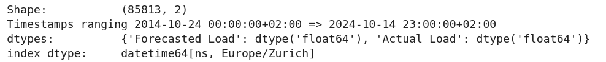

# :fontawesome-solid-vial: Exploratory Data Analysis (EDA)

## Introduction 

Now that we have access to our data source, let's explore it.
We must ensure we have a good understanding of what the data is -- and isn't -- before we can move onto modelling options.

In other words, let's dive into the **Exploratory Data Analysis (EDA)**.

## What does our data look like ?

How many rows do we have? In what format is our data stored? How far back does our data go? Do we have data for every single hour? Do we have duplicates? Do we have empty rows?

!!! tip Data assessement
    Qualify -- in quantity and quality -- your data sources.

To answer these questions, let's start by fetching data for as far back as we can, and printing some basic informations about it.

```python
print("Shape: \t\t", df.shape)
print(f"Timestamps ranging {df.index.min()} => {df.index.max()}")
print('dtypes: \t', df.dtypes.to_dict())
print('index dtype: \t', df.index.dtype)
```

<figure markdown="span">
  { width="100%" }
  <figcaption>Basic informations about the fetched ENTSO-E data.</figcaption>
</figure>

Let's now plot it.

```python
import plotly.express as px

fig = px.line(
    df, x=df.index, y='Actual Load', 
    markers=True, 
    title='Lineplot of all the available Actual Load',
    labels={'index': 'Date', 'Actual Load': 'Actual Load [MW]'}
)
```

<iframe src="../assets/eda/actual_load_lineplot.html" width="100%" height="400"></iframe>

We can see data ranging from 2014 to 2024, with a nice -- and expected -- seasonality throughout the years.
It does seem like some days are missing -- especially in 2024.

## Empty, missing or duplicated data

### Empty data

Does the ENTSO-E API send us empty data?[^1] Let's check.

[^1]: By _empty_, I mean that the ENTSO-E sent something, but that something does not contain anything useful, typically a `NaN`.

```python
import plotly.express as px

df.loc[df['Actual Load'].isna(), 'color'] = 'Empty Actual Load'
df.loc[df['Forecasted Load'].isna(), 'color'] = 'Empty Forecasted Load'

mask = df.isna().any(axis=1)
fig = px.scatter(
    x=df[mask].index, y=mask[mask], color=df[mask].color,
    title='Scatterplot of the empty loads (Actual & Forecasted)',
    labels={'x': 'Date', 'y': 'Whether the data is empty', 'color': ''}
)
```

<iframe src="../assets/eda/empty_load_lineplot.html" width="100%" height="400"></iframe>

They do send us empty data, namely:

- The actual load is empty between now and tomorrow evening. This makes sense, because these are future datetimes for which we have a forecasted load. 
- The forecasted loads is empty for 24h straight on the 24.11.2014. Looking at the full data, this corresponds to a streak of _missing_ actual loads in 2024.
- The forecasted loads is empty for 24h straight on the 31.08.2015. Likely some kind of maintenance happened on that day on the ENTSO-E's side.

### Missing data

How about missing data[^2]? Do we have all the rows between the first datetime and the last? Let's check.

[^2]: By _missing_, I mean that the ENTSO-E did _not_ send data corresponding to some specific hours. 

```python
import plotly.express as px

df = df.asfreq('h', fill_value='FILLED')

df.loc[(df == 'FILLED').any(axis=1), 'color'] = 'Missing Load'
mask = (df == 'FILLED').any(axis=1)

fig = px.scatter(
    x=df[mask].index, y=mask[mask], color=df[mask].color,
    title='Scatterplot of the missing loads (Actual & Forecasted)',
    labels={'x': 'Date', 'y': 'Whether the data is missing', 'color': ''}
)
```

<iframe src="../assets/eda/missing_load_lineplot.html" width="100%" height="400"></iframe>

A lot of data is missing from the end of 2024, and then the first hour of every year.

### Duplicated data

Does the ENTSO-E send us rows with the same index? Let's check.

```python
df.index.is_unique
# True
```

That was fast.

## ENTSO-E's official prediction

The ENTSO-E provides their own forecasted load; how good is it?
A common performance metric used to assess the "goodness" of a forecast is the **Mean Absolute Percentage Error (MAPE)**, defined as:

$$\text{MAPE} = \frac{100}{n}\sum^n_i{\left|\frac{A_t - F_t}{A_t}\right|}$$

where $A_t$ is the actual value at timestep $t$, $F_t$ the forecasted value at timestep $t$, and $n$ the amount of timesteps to consider.

Computing that metric over the entire historical data yields us a MAPE of 5.8% -- i.e. on average, the ENTSO-E's official forecast is off by 5.8%.

But how did that evolve through time? Is the MAPE stable through time, or did the official model's performance change? Let's check by plotting the **Absolute Percentage Error (APE)** for each timestep.

```python
import plotly.express as px

df = df.dropna() # Only consider rows where we have both the forecasted and actual load
df['APE'] = df.apply(
    lambda row: 100 * abs(row['Actual Load'] - row['Forecasted Load']) / row['Actual Load'],
    axis=1
)
fig = px.scatter(
    df, x=df.index, y='APE', 
    title='Scatterplot of the Absolute Percentage Error (APE) of the official ENTSO-E forecast',
    labels={'index': 'Date', 'Actual Load': 'Actual Load [MW]'}
)
```

<iframe src="../assets/eda/ape_scatterplot.html" width="100%" height="400"></iframe>

We notice several things, namely:

- The APE seemes to have increased in 2023 and 2024.
- There is a year-long oddity where the forecast _almost_ perfectly matches the actual values; this is likely due to something happening on ENTSO-E's side, and skews the overall MAPE towards a lower -- i.e. better -- value.
- In February 2023, the APE was off the charts; how come?
- The freshest timesteps have better APE than older ones; how come?

How do these observations translate to the MAPE over various timespans? Let's find out!

```python
from datetime import timedelta
import plotly.express as px

# Figure out the latest timestamp with a load
with_load_latest_ts = df[~df['Actual Load'].isna()].index.max() 

# Compute the MAPE over different timespans
delta_h_to_mape = {}
for delta_h in [1, 24, 48, 24*7, 24*30, 24*365]:
    delta_h_to_mape[delta_h] = df.APE[df.index > with_load_latest_ts - timedelta(hours=delta_h)].mean()

# Combine the MAPE values into a dataframe for easier plotting
mape_df = pd.DataFrame({
    'delta_time': ['Last hour', 'Last 24h', 'Last 2 days', 'Last week', 'Last month', 'Last year'],
    'MAPE': delta_h_to_mape.values()
})

fig = px.scatter(
    mape_df, x='delta_time', y='MAPE', 
    title='Scatterplot of the ENTSO-E forecast\'s Mean Absolute Percentage Error (MAPE), <br>over different timespans',
    labels={'delta_time': 'Timespan', 'MAPE': 'MAPE [%]'}
)
```

<iframe src="../assets/eda/mape_scatterplot.html" width="100%" height="400"></iframe>

As we can see, the MAPE is excellent (~3%) over the last 1-2 days, and then more than doubles if we look at at the full week, month, and year.[^3]

[^3]: I later found out that the `Actual Load` -- as communicated by the ENTSO-E -- gets updated -- likely to be closer to reality -- within roughly a week of the first publication. 

## Conclusion

Now that we have a good understanding of our data, let's start modelling.[^4]

[^4]: We could of course keep on exploring, and e.g. investigate the seasonality of our data through an auto-correlation plot. But for now, let's move onto our next challenge.


