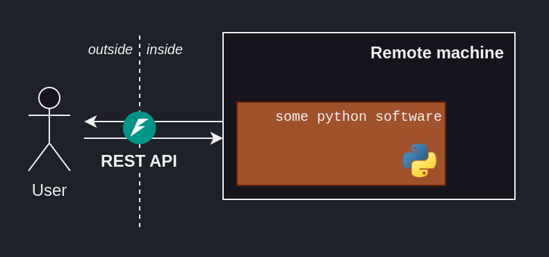
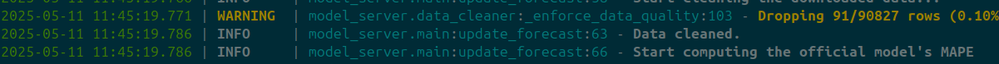

# :fontawesome-solid-industry: Industrialization

## Introduction 

We now have a working model, performing at an acceptable level. Our goal is to bring it to the user.

Which begs the question: How does our user want to consume our solution?[^1]

[^1]: When we first talked to our user, we sketched out a rough idea of how the solution would be consumed -- and deployed. It is important not to wait till we're at the doors of industrialization to start thinking about deployment options, as they might impact the modelling options available to us. We do _not_ want to end up so far in, only to have to go back to modelling because we realized the user wants to consume their massive model on a low-power chip. 

The way the ML model will be consumed educates us on how we should deploy it. 
The way we deploy our model will heavily influence how we design our ML system, and hence how we will industrialize[^2] it.

[^2]: Also called _productionalize_.

!!! tip "User needs educate deployment strategies."
    The needs of the user will educate how we should deploy the model, not the other way around.

    An unused ML solution is a failed ML solution.

In this section, we will go over the ML system design of our solution, followed by tools and tips on how to end up with production-ready software.

## ML System Design

In our case, the user **needs** to have the latest forecast available whenever they'd like.

Since the ENTSO-E data is published hourly, this means

- Fetching the fresh data every hour.
- Training and testing the model on the latest data every hour.
- Forecasting the load for the next 24h.[^3]
- Having the latest forecast available to the user.

[^3]: This is called _offline inference_.

We propose hosting our ML solution on a remote machine, which can be access via a REST API.
The remote machine will periodically fetch the latest ENTSO-E data and train a model on them.
That model will then be used to predict the loads for the next 24h, which will be saved to disk.
Upon receiving the appropriate request through the REST API, the machine will return the latest forecast.

<figure markdown="span">
  { width="90%" }
  <figcaption>Big picture of our ML solution's system design.</figcaption>
</figure>

## Production-ready software

Another facet of bringing an ML solution to a user is that we now need to have confidence that our code is maintainable, shareable, and reproducible. 

- **Maintainability**:
    - Do I have any confidence that my code works as intended?
    - In two months, can I easily come back to it? 
    - If I change some code, how do I know it is still working as intended?
- **Shareability**: 
    - Let's say I way to share it to our user; how can I do that?
    - A friend wants to help me out; how can they do that?
- **Reproducibility**: 
    - Am I confident that I can easily reproduce the results outlined previously?

All three issues are interlinked.
If you're the one maintaining the code, you're basically sharing with future you, who has to reproduce past results.

So far, we were basically experimenting, which allowed for some leeway in terms of coding practices for the sake of speed.
Now, let's look over some tools to make your code more maintainable.[^4]

[^4]: Some of these tools might feel like common sense to some people, but I prefer to highlight the obvious than be confusing.

### Version Control

Version control software allows you to keep track of the changes in your code, greatly enhancing maintainability.

`git` is by far the industry-standard, along with `GitHub` as a hosting solution.
I recommend using them as early as possible, in any project.<br>

An upside of using GitHub[^5] is their [GitHub Actions](https://github.com/features/actions), allowing us to automate part of our workflow, and further improve the shareability of our code.

!!! tip "Version control your code"
    Version control your code to keep track of its evolution.    

[^5]: Most `git` hosting solutions have an equivalent.

### Use `.env`

Using `git` means creating a trail of every single (commited) state that the software went through.
Hard-coding sensitive -- i.e. private -- data, such as an API key or password -- is an easy-mistake, which would result in saving it to that trail, seemingly-forever.[^6]

[^6]: You can always edit a file's `git` history, but it's messy.

Additionally, we might have certain variables that would depend on our running environment, i.e. dev or production.

Using an `.env` file solves both of these issues.

!!! tip "Use `.env`"
    Private or environment-dependent variables should go in an `.env`, which you will not be committing to history.[^7]

    I use and like [`python-dotenv`](https://github.com/theskumar/python-dotenv), but alternatives exist.

[^7]: Thank you `.gitignore`.

### Build REST API with `FastAPI`

Making the ML solution available to the user often means having the user interact with our solution through a REST API.

[`FastAPI`](https://fastapi.tiangolo.com/)[^8] is a handy Python-based tool, allowing us to easily turn our ML solution into an accessible endpoint.

<figure markdown="span">
  { width="80%" }
  <figcaption><code>FastAPI</code> allows us to turn a Python script into an accessible endpoint.</figcaption>
</figure>

[^8]: [`Flask`](https://flask.palletsprojects.com/en/) is an alternative.

### Productivity tools

Developping on Linux, I interact with the terminal _a lot_. To make this whole process more comfortable, I highly-recommend several tools:

- `zsh` with [`oh-my-zsh`](https://ohmyz.sh), [`zsh-autosuggestions`](https://github.com/zsh-users/zsh-autosuggestions), [`zsh-syntax-highlighting`](https://github.com/zsh-users/zsh-syntax-highlighting) and [`fzf`](https://github.com/junegunn/fzf)

<figure markdown="span">
  { width="100%" }
  <figcaption>A comfortable terminal session, thanks, amongst others, to <code>oh-my-zsh</code>.</figcaption>
</figure>

- [`terminator`](https://gnome-terminator.org) allows for several terminal sessions within one terminal

<figure markdown="span">
  { width="100%" }
  <figcaption>Several terminal sessions in one terminal, thanks to <code>terminator</code>.</figcaption>
</figure>

### Virtual environment

A given Python project will call for a specific Python version with specific packages.
To compartimentalize all the Python packages used in a given project, use a **virtual environment** (venv for short).

!!! tip "Use a virtual environment"
    I use `uv` to manage them, but others exist.

    `uv` will create a `.venv` folder, which will contain all the packages installed in the virtual environment. 

### From notebooks to `.py`

Jupyter notebooks (`.ipynb`) -- while great for experimentation -- are hard to test and run non-interactively. 
Hence, we move away from them, and start implementing our ML pipeline in `.py`.

#### Use `requirements.txt`

So far, we've been `pip install`ing needed packages willy-nilly.
Due to that, it would hard for us -- or anyone we would like to share the code with -- to reproduce the Python environment in which our code is running.

Writing a `requirements.txt` file -- centralizing the needed packages that our project relies on addresses that.

```yaml title="Example of a requirements.txt"
fastapi==0.112.2 # package_name==version
fastapi-cli==0.0.5
entsoe-py==0.6.8
numpy==1.26.4
pandas==2.2.2
```

#### Log properly 

While developping, an over-reliance on `print` statements is acceptable, as current-us will likely be the only consumer of these "logs".

As we move onto industrialisation, a proper logging setup eases future pain, and helps ensuring the system is running as we'd expect.

Logging libraries distinct themselves from simple `print` statements thanks to their 
- **Log level support**, allowing us to distinguish between -- e.g. -- mere good-to-know logs (INFO), watch-out-something-wrong-happened logs (WARNING) and failures (ERROR). 
These levels help us read through the logs, as well as parse them were something to go wrong.

- **Formatting** utilities, allowing us to color and/or format (e.g. specifying the file logging, or the timestamp).
- **Multiple sinks**, allowing us to output our logs to several locations, e.g. the shell and some `.logs/` folder, for safe-keeping.  

!!! tip "Log diligently"
    Many logging libraries help you get the job done. I find `loguru` easier to use, with less boilerplate and neat shell coloring.

<figure markdown="span">
  { width="100%" }
  <figcaption>A readable log output, thanks to <code>loguru</code>.</figcaption>
</figure>

#### Write clean code

There is no easy way to measure the "cleanliness" of a codebase.
Below are a few non-exhaustive list of guidelines I follow to write clean and readable code.

- Write docstrings and comments

    !!! tip "Write Docstrings"
        Over the years, a lot of docstring flavors saw the light of day. <br>
        Just [pick one you like](https://docs.dasch.swiss/latest/DSP-TOOLS/developers/code-quality-tools/python-docstring-formatting/) and stick to it throughout your codebase.

- Use [typehints](https://docs.python.org/3/library/typing.html)

    !!! tip "Strongly-typed docstrings in a dynamically-typed language"
        Python is dynamically-typed, meaning no types are enforced. <br>
        Still, to increase readability one should use typehints, as well as write the types in the docstring.

- Use code formatters

    !!! tip "Code formatters"
        Consistency improves readability.
        
        Code formatters automatically formats the code to follow some guidelines. <br>
        I like and use [`black`](https://github.com/psf/black) to format my code, and [`isort`](https://pycqa.github.io/isort/) to sort my imports.

- Use [pre-commit hooks](https://pre-commit.com/) to automatically apply certain code-formatting steps upon committing to `git`.

#### Write tests

Untested code breaks easily. What happens if in 2 months I make some change to the codebase; can I be confident I didn't break the whole thing?
That's were tests come in. To test python code, [`pytest`](https://docs.pytest.org/en/stable/) is a battle-tested solution.

## Conclusion

We now have a maintainable end-to-end solution. We can move onto deploying to our user, so that they can start using it. 