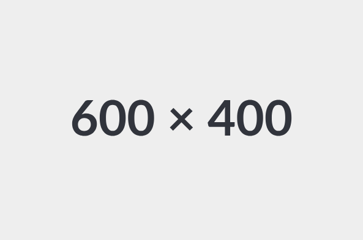

# :material-atom: Modelling

Now that we have a better understanding of the data, let's start predicting.

## Define the problem

> Insert great quote about how defining the problem is half the battle.

Before we start solving our modelling problem, we must define the problem.

There are several correct ways to define our task. 
In this case, we can take inspiration from the way the ENTSO-E website names their prediction, i.e. `Day-ahead Total Load Forecast`, and assume that they forecast the consumption between `hour` and `hour + 1` using the data available a full day before `hour`.

> As I would find out later, forecasts are usually added to the website in bulk, at 05:41 in the morning. Still, we picked this approach and are sticking with it. This would allow the solution's users to peek 24h into the future at any time of the day.

Our modelling task could then be phrased as such: 

```
At time t, given all the load data prior to t, predict the load in MW at t + 24h
```

## Where to start

Where can we even start solving this ?

Young and freshly out-of-college, we could let our excitement win and dive straight into implementing some complex^1 ML-based time-series prediction model.[^2] We would measure our approach through the previously-chosen performance metric -- MAPE -- and would -- let's assume -- end up with a MAPE of 8%.

Amazing !

And now we're left to ask: Is that good ?

<figure markdown="span">
  { width="300" }
  <figcaption>PLOT MODEL COMPLEXITY vs PERFORMANCE METRIC, with one data point at a "HIGHLY COMPLEX"</figcaption>
</figure>

At this point, there would be no way to know. 
What's worse is, we wouldn't even know if it's better than a simpler -- often called "dummy" -- approach. 
What we would know is that getting to that 8% cost us time and effort, and going forward with our approach would cost us more of it -- more so than a simpler approach.¹

What would then be our next step ? Well, we would implement that "simpler" approach to see how much good all of this complexity brought us and be able to **compare**.
Being able to **compare** performances allows us to better understand the cost/benefit ratio of adding complexity to the model. 

<figure markdown="span">
  { width="300" }
  <figcaption>TODO PLOT MODEL COMPLEXITY vs PERFORMANCE METRIC with two data points, one simple and one complex</figcaption>
</figure>

This brings me to my first point:

<center><h1><font size="6"><b>Start simple¹</b></font></h1></center>							

Let's now assume we did that. We started simple, built a _dummy baseline_ and got a great performance: a MAPE of 10%.

Amazing !

And now the same question comes back: Is that good ?

This brings me to my second point:

<center><h1><font size="6"><b>Most industry problems have a "this is good-enough" threshold.</b></font></h1></center>							
	 
<figure markdown="span">
  { width="300" }
  <figcaption>TODO PLOT MODEL COMPLEXITY vs PERFORMANCE METRIC, adding horizontal line for "good-enough"</figcaption>
</figure>

In most situations, we are not doing machine learning to chase the highest ever performance at all costs;² We're solving a business problem. 
Machine learning is a tool for us to solve that problem. But at some point -- at some specific performance score -- the problem can be deemed solved, and we can move onto the next challenge: making our solution available to the user (i.e. customer, colleague, friend, ...).

It is often hard to figure out that threshold. People won't tell you "We'd like a F1 of 0.93", or "The inference time must be under 100ms while keeping the BLUE-score at 0.8". 

Figuring out what matters to the user -- inference time, prediction quality, model explainability, computation cost, ... -- can help us figure out what we should measure.

Once we know what to measure, a back-and-forth with the user², trying out different solutions as the modelling goes on, can help approximate this "good-enough threshold".

Now let's say we are trying different approaches, yielding different MAPE scores, but none of them really satisfy us. One thing to keep in my is my third point:

<center><h1><font size="6"><b>Most prediction problems have a performance upper-bound.</b></font></h1></center>							 

That is, there is _usually_ some amount of randomness when predicting the future from a given set of observations. A direct consequence of that is that regardless of how good your model is, you will not be able to perfectly predict the future.

<figure markdown="span">
  { width="300" }
  <figcaption>PLOT MODEL COMPLEXITY vs PERFORMANCE METRCI, adding horizontal line for "highest-possible score".</figcaption>
</figure>

All you can do is hope that this upper-bound is above the "good-enough" threshold.
To add insult to injury, this upper-bound is rarely available to us. 
What we can do is measure the human-level performance on that task, which would give us a lower-bound to that upper-bound.

<figure markdown="span">
  { width="300" }
  <figcaption>TODO PLOT MODEL COMPLEXITY vs PERFORMANCE METRCI, adding horizontal line for human-performance</figcaption>
</figure>


Now that we've talked extensively about model performances, let's move onto some actual modelling.

¹ When I talk about complexity here, I don't mean amount of parameters -- although it is usually correlated -- but complexity of the overall ML lifecycle of our approach.

¹ We all know that itch.

¹ To state the obvious: Simple approaches are _usually_ easier to develop, industrialize and deploy than complex ones.

³ I am _by far_ not the first person to make that point -- with KISS being one example of it -- but it's so easy to forget that I think it's important to emboss.

² If that's what you want to do, academy/research has a higher density of such problem statements

³ When possible

## Dummy Baseline 

## Time-serie forecasting as a regression

<figure markdown="span">
  { width="300" }
  <figcaption>TODO RESHAPING THE DATA TO FIT A REGRESSION TASK</figcaption>
</figure>

## Leveraging past-load's statistics