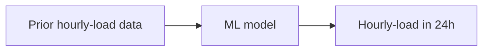
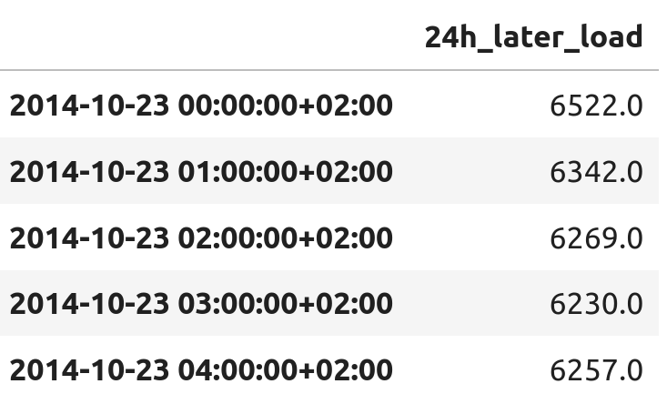
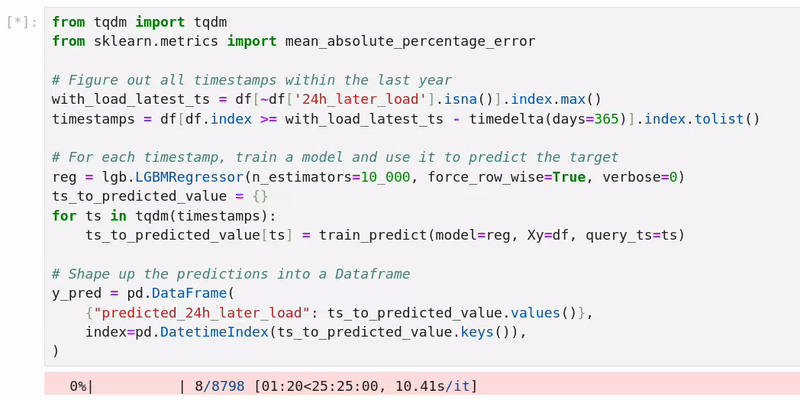

# :material-atom: Modelling

## From business problem to modelling task

!!! quote "Charles Kettering"
    A problem well-stated is a problem half-solved


Now that we have a better understanding of our data, let's go back to our business problem, i.e.: 

!!! note "Business Problem"
    We are an energy distribution company.
    As such, we deal with the consumption of energy throughout our grid.
    We don't know how said consumption will evolve in the future, and it would help us to know.

We want -- equipped with our new understanding of the context, constraints and needs of our business -- to solve this problem.
To solve it, we first need to translate it into a _modelling task_, i.e. to formulate it in terms of input, machine learning model and output. 

There are several correct ways to do so. 
In our case, we take inspiration from the way the ENTSO-E names their own prediction, i.e -- `Day-ahead Total Load Forecast` -- and assume that they forecast the consumption between `t` and `t + 1h` using the data available a a full day before `t`.[^1]

[^1]: As I would figure out later, forecasts are usually added to the ENTSO-E website in bulk, at 05:41 in the morning. Still, we picked this approach and are sticking with it. It is interesting to note that I _assumed_ that's how they generated their predictions, and should have asked them directly via email -- as outlined in the motivation part of this writeup.

Our modelling task could then be formulated as such: 

!!! note "Modelling task"
    At time `t`, given all the load data prior to `t`, predict the load in MW at `t + 24h`

<center>

</center>

We wrangle the data to better represent our modelling task. That is, each row's index is now the timestamp `t`, and the target -- called `24h_later_load` -- is the actual load [MW] between `t + 24h` and `t + 24h + 1h`.

```python
from datetime import timedelta

df = df.set_index(df.index - timedelta(hours=24))
df = df.rename(columns={'Actual Load': '24h_later_load'})
df.head()
```

<figure markdown="span">
  { width="50%" }
  <figcaption>A data model fitting our modelling task.</figcaption>
</figure>

## Where to start

Where can we even start solving this ?

Let's stand back a little bit and think about the choice in front of us.
We're about to build some machine learning model to solve our modelling task.
We can go with an ARIMA model, a transformer-based approach, or even the latest NeurIPS paper.[^2]
Really, we have to choose how complex[^3] our first attempt at modelling should be.

[^2]: We all know that itch.
[^3]: When I talk about complexity here, I don't mean amount of parameters -- although it is usually correlated -- but complexity of the overall ML lifecycle of our approach. We are building a full-fledged solution -- along with tooling to maintain, fix and update our solution. Its complexity goes beyond how many fake-neurons our model has.

Young and freshly out-of-college, we could let our excitement win and dive straight into implementing the most complex ML-based time-series prediction model. Assuming that surely complexity and modernity are synonymous with performance. This would be a mistake, as our goal is _not_ to build the best model, but to answer the need of the business.[^4] 

[^4]: If that's what you want to do, academy/research has a higher density of such problem statements

!!! tip "There is such a thing as good-enough"
    Most industry problems have a "this is good-enough" threshold.

This "good-enough" threshold is the lowest performance that satisfies the needs of the business. It's often hard to express in hard numbers, and comes from understanding the business needs. Often, you will end up with an approximation acting as a proxy, meaning that a model performing up to that standard _should_ fulfill those needs.[^5] 

[^5]: Here we talk about performance as if it was uni-dimensional. It rarely is You should consider -- amongst other things -- the raw performance, the inference time, the ease of maintenance, the explainability, the upfront training cost and the deployment cost. 

<figure markdown="span">
  { width="100%" }
  <figcaption>PLOT MODEL COMPLEXITY vs PERFORMANCE METRIC, with good-enough threshold"</figcaption>
</figure>

Back at our initial choice, and we have either start simple or complex.

We **really** should start simple, for many reasons:

- A simple solution might place us above the "good-enough" threshold, saving us a lot of work.
- It is often difficult to know where the "good-enough" threshold should be. Building a simple approach and getting user feedback allows us to place it above or below that approach's performance.
- A simple solution is an effective benchmarking tool against which we can rank other solutions.
- A simple solution is a good sanity check that our understanding of problem and data source are sound.
- Let's assume we started with a complex solution. The cost (in time and ressource) to go onwards with it -- in terms of industrialization, deployment and maintenance -- would far outweigh the cost of _trying_ a simple solution. And if a simple solution was acceptable, then we'd go for the simple solution. Hence, even if we started from a complex approach, we'd build the simple approach _just to check_ and justify the complex approach.
- It's easier to start simple and add complexity step by step.

!!! tip "Please"
    Start simple[^6]
				

[^6]: I am _by far_ not the first person to make that point -- with KISS being one example of it -- but it's so easy to forget that I think it's important to hammer it in.

Wonderful, let's say we listened and started with a simple approach -- a _dummy baseline_. Unfortunately, the user is not satisfied -- i.e. the business need is not answered.

<figure markdown="span">
  { width="100%" }
  <figcaption>TODO PLOT MODEL COMPLEXITY vs PERFORMANCE METRIC with good-enough threshold, and a simple datapoint under the threshold</figcaption>
</figure>

From that point on, we can add complexity step-by-step, till we -- hopefully -- surpasses the "good-enough" threshold.

As we try different approaches, we should be mindful that we are facing a performance upper-bound.

!!! tip "Performance upper-bound"
    Most prediction problems have a performance upper-bound.							 

That is, there is _usually_ some amount of randomness when predicting the future from a given set of observations. A direct consequence of that is that regardless of how good your model is, you will not be able to perfectly predict the future.

<figure markdown="span">
  { width="100%" }
  <figcaption>PLOT MODEL COMPLEXITY vs PERFORMANCE METRCI, adding horizontal line for "highest-possible score".</figcaption>
</figure>

All you can do is hope that this upper-bound is above the "good-enough" threshold.
Akin to the "good-enough" threshold, this upper-bound is rarely available to us. 
What we can do is measure the human-level performance on that task, which would give us a lower-bound to that upper-bound.

<figure markdown="span">
  { width="100%" }
  <figcaption>TODO PLOT MODEL COMPLEXITY vs PERFORMANCE METRCI, adding horizontal line for human-performance</figcaption>
</figure>

Now that we've talked extensively about where to start, let's actually start modelling.

## Dummy Baseline 

Back to our wrangled dataset:

<figure markdown="span">
  { width="50%" }
  <figcaption>Our data model.</figcaption>
</figure>

We'll start with the following dummy baseline:

!!! note "Dummy baseline"
    Predict that the hourly-load at time `t + 24h` is yesterday hourly-load at the same hour, i.e. the hourly-load at time `t - 24h` [^7]

[^7]: Why not directly use the hourly-load at time `t`? Because as per the modelling task, we only know the historic load _up to_ time `t`, and hence cannot use the load between `t` and `t + 1h` to build our forecast.

??? note "Build, test and plot the dummy baseline"
    ```python
    from datetime import timedelta
    from sklearn.metrics import mean_absolute_percentage_error
    import plotly.express as px

    # Enrich the data with the 24h_ago_load
    df = df.asfreq('h') # Enforce an hourly frequency
    df['24h_ago_load'] = df['24h_later_load'].shift(48)

    # Only consider the last year
    with_load_latest_ts = df[~df['24h_later_load'].isna()].index.max() 
    df = df[df.index >= with_load_latest_ts - timedelta(days=365)]

    # Build y_true and y_pred
    df = df.dropna()
    y_true = df['24h_later_load']
    y_pred = df['24h_ago_load']
    print(f'MAPE over the last year: {mean_absolute_percentage_error(y_true, y_pred) * 100:.2f}%') 
    # MAPE over the last year: 8.97%

    # Plot the last month
    df = df[df.index >= df.index.max() - timedelta(days=30)]

    fig = px.line(
        df, x=df.index, y=['24h_later_load', '24h_ago_load'], 
        title='Actual load and dummy forecast over the last month',
        labels={'index': 'Date', 'value': 'Load [MW]', 'variable': ''}
    )

    fig.for_each_trace(lambda t: t.update(name={'24h_later_load': 'Actual load', '24h_ago_load': 'Dummy forecast'}[t.name]))
    ```

Approaching our problem like this yields the following results over the past year:

<center>

| Yearly-MAPE [%]           | Model                          |
| ------------------------- | :----------------------------- |
| 10.8                      | ENTSO-E forecast               |
| **8.97**                  | Dummy baseline                 |

</center>

<iframe src="../assets/modelling/dummy_forecast_lineplot.html" width="100%" height="400"></iframe>

Now, that's surprising -- I'd have expected our dummy forecast to be worse than the official one. It is likely they are relying on less informations than us to forecast the future loads.[^1] Still, we can work off this baseline to further improve our approach.

## LightGBM to the rescue

I love `lightgbm`.

It is easy to deploy, battle-tested, fast to iterate one and performs extremely well. [^7]

[^7]: For tabular data, gradient-boosted-trees-based approaches often performs on par with -- if not above -- _much more complex_ approaches (NN-based approaches of all flavors).

Whenever I am solving a task where it might an answer, I try it. I'll only whip out the big guns -- i.e. deep learning -- if I really need it.

Let's continue our modelling journey by building upon it.

### Back-testing

Now, before we dive into training -- and testing -- an LightGBM-based model -- any model really -- we should take a step back and think about what we're about to do.

Our problem looks like a classic regression task. As such, one might feel enclined to follow the classic regression-task flow, i.e.

1. Randomly divide the data into train and test sets 
2. Train some model on the train set
3. Test that trained model on the test set

If we did that, we would end up with an great-performing model. We would happily go onto making it available to our users, but then that model would underperform.

Why?

Because we're not solving a typical regression task, we're dealing with timeseries. Whenever we are training/testing a model, our testing conditions should mimic as closely as possible our real-life conditions. Essentially, we're assuming that the test data has been drawn from the same distribution as our real-life data. If that assumption is wrong, then any performance on the test set might not correlate to our model's real-life performance.[^8]

[^8]: The assumption that the _train_ data is representative of the _test_ data is also usually made -- silently -- but any mismatch would "only" translate into a low-performing model (on the test set), i.e. we would be aware of how the model would perform in the wild.

!!! tip "Testing should be real-life"
    Testing conditions should be as close as possible to the real-life conditions.

How does that impact us in our time-series prediction task? Well, by randomly dividing up the data into train and test sets, we're allowing the model to peek into the future. The model is learning to **interpolate**, whereas in real-life it will have to **extrapolate**:

<figure markdown="span">
  { width="50%" }
  <figcaption>Interpolation vs Extrapolation</figcaption>
</figure>

Hence, whenever the data we are feeding our model is time-sensitive -- even if not explicitely a time-series -- we should split the train and test set time-wise. 

!!! tip "Predict the future from the past, not the future"
    Whenever the data is time-sensitive, split it time-wise.

In our case, this translates into is is called **back-testing**.
We're training our model once per prediction, feeding all the data that was available at the fictious time of prediction.
Hence, to predict the next 24h -- 24 predictions -- we'll train 24 models.

<figure markdown="span">
  { width="50%" }
  <figcaption>Backtesting, highlighting the train set --> predicted val</figcaption>
</figure>

### Naive LightGBM

Back to our gradient-boosted trees, let's build a LightGBM model leveraging the same data as our dummy model, i.e. the load 24h ago. 

We build it incorporating the back-testing strategy -- and test it as such -- over the last year. Note that this means training 8760 models, one for each hour in a year.

??? note "Train-test a LightGBM model, with back-testing"
    ```python
    import lightgbm as lgb
    import pandas as pd
    from tqdm import tqdm
    from sklearn.metrics import mean_absolute_percentage_error

    def train_predict(model: lgb.LGBMRegressor, Xy: pd.DataFrame, query_ts: pd.Timestamp) -> float:
        # Extract the testing X
        if not query_ts in Xy.index:
            raise ValueError(f"Query timestamp {query_ts} is missing from Xy's index.")
        X_test = Xy.loc[[query_ts]].drop(columns=["24h_later_load"])

        # Prepare training data
        Xy = Xy.dropna(subset=("24h_later_load"))
        Xy_train = Xy[Xy.index < query_ts]  # Only train on data strictly before the ts
        X_train, y_train = Xy_train.drop(columns=["24h_later_load"]), Xy_train["24h_later_load"]

        # Train the model
        model.fit(X_train, y_train)

        # Predict
        return float(model.predict(X_test)[0])

    # Figure out all timestamps within the last year
    with_load_latest_ts = df[~df['24h_later_load'].isna()].index.max() 
    mask = (df.index <= with_load_latest_ts) & (df.index >= with_load_latest_ts - timedelta(days=365)) 
    timestamps = df[mask].dropna(subset=('24h_later_load')).index.tolist()

    # For each timestamp, train a model and use it to predict the target
    reg = lgb.LGBMRegressor(n_estimators=10_000, force_row_wise=True, verbose=0)
    ts_to_predicted_value = {}
    for ts in tqdm(timestamps):
        ts_to_predicted_value[ts] = train_predict(model=reg, Xy=df, query_ts=ts)

    # Shape up the predictions into a Dataframe
    y_pred = pd.DataFrame(
        {"predicted_24h_later_load": ts_to_predicted_value.values()},
        index=pd.DatetimeIndex(ts_to_predicted_value.keys()),
    ) 
    ```

Quickly, we hit a wall: generating a year's worth of prediction would take >25h.

<figure markdown="span">
  { width="100%" }
  <figcaption>Generating a year's worth of prediction takes more than 25h.</figcaption>
</figure>

What can we do? Well, one way to address this issue is to subsample the testing timestamps, and use that as a test set. That way, our MAPE over the year will be an _estimate_ of the actual MAPE. 

```python
from random import sample
import numpy as np

# Subsample to only train <N_TIMESTAMPS_TO_CONSIDER> models
timestamps = sample(timestamps, k=<N_TIMESTAMPS_TO_CONSIDER>)
```

To motivate this approach, let's check that this estimate isn't too far off the actual MAPE value by training a smaller model -- a LightGBM with only 1 estimator -- on all timestamps -- making it 8760 models -- and then computing the yearly-MAPE with varying amount of discarded timestamps.

??? note "Study the impact of estimating the MAPE through timestamp subsampling"
    ```python
    from tqdm import tqdm
    from sklearn.metrics import mean_absolute_percentage_error
    from random import sample

    # Figure out all timestamps within the last year
    with_load_latest_ts = df[~df['24h_later_load'].isna()].index.max() 
    mask = (df.index <= with_load_latest_ts) & (df.index >= with_load_latest_ts - timedelta(days=365)) 
    timestamps = df[mask].dropna(subset=('24h_later_load')).index.tolist()

    # Subsample to only train 100 models
    # timestamps = sample(timestamps, k=100)

    # For each timestamp, train a model and use it to predict the target
    reg = lgb.LGBMRegressor(n_estimators=1, force_row_wise=True, verbose=0)
    ts_to_predicted_value = {}
    for ts in tqdm(timestamps):
        ts_to_predicted_value[ts] = train_predict(model=reg, Xy=df, query_ts=ts)

    # Shape up the predictions into a Dataframe
    y_pred = pd.DataFrame(
        {"predicted_24h_later_load": ts_to_predicted_value.values()},
        index=pd.DatetimeIndex(ts_to_predicted_value.keys()),
    )

    # Get randomly-ordered timestamps to study the MAPE
    random_timestamps = y_pred.index.tolist()
    np.random.shuffle(random_timestamps) 

    # Package the y_pred and y_true into a dataframe
    y_true = df.loc[y_pred.index, ['24h_later_load']]
    y_df = pd.concat([y_true, y_pred], axis=1)
    y_df['APE'] = y_df.apply(lambda row: 100 * abs(row['24h_later_load'] - row['predicted_24h_later_load']) / row['24h_later_load'], axis=1)

    # For each discarded proportion, compute the MAPE
    discarded_proportion_to_mape = {}
    for i in tqdm(range(len(random_timestamps))):
        discarded_proportion = i / len(random_timestamps) * 100
        discarded_proportion_to_mape[discarded_proportion] = y_df.loc[random_timestamps[i:], 'APE'].mean()

    mape_df = pd.DataFrame({
        'discarded_proportion': discarded_proportion_to_mape.keys(),
        'estimated_MAPE': discarded_proportion_to_mape.values(),
    })

    # Plot
    fig = px.line(
        mape_df, x='discarded_proportion', y='estimated_MAPE', 
        title='Evolution of the yearly-MAPE <br>when discarding some proportion of the timestamps making up the year',
        labels={'discarded_proportion': 'Proportion of discarded timestamps [%]', 'estimated_MAPE': 'Estimated MAPE [%] over the last year'}
    )

    fig.add_hline(y=mape_df.loc[0].estimated_MAPE, line_dash="dot",
                  annotation_text="Actual MAPE", 
                  annotation_position="bottom right")
    ```

<iframe src="../assets/modelling/mape_degradation_study.html" width="100%" height="400"></iframe>


Wonderful! As we hoped, we can get away with only sampling 10% of the data and still having our estimated MAPE be close (within 10%) of the actual MAPE. 

Let's go back to training our LightGBM model, this time judging it on 1% of the data, i.e. 87 samples:

<center>

| Yearly-MAPE [%]                             | Model                          |
| ------------------------------------------- | :----------------------------- |
| 10.8                                        | ENTSO-E forecast               |
| 8.97                                        | Dummy baseline                 |
| **8.47** (estimated w/ 1% of timestamps)    | LightGBM w/ 24h-ago-load       |

</center>

Great, on par with our dummy baseline. Let's do better.

### LightGBM with more timestamps

Currently, the only load-related information our model can use is the 24h-ago-load; how about enrich our data with more timesteps? 

```python
# Enrich the data w/ more past loads
df['1h_ago_load'] = df['24h_later_load'].shift(24 + 1)
df['2h_ago_load'] = df['24h_later_load'].shift(24 + 2)
df['3h_ago_load'] = df['24h_later_load'].shift(24 + 3)
df['7d_ago_load'] = df['24h_later_load'].shift(24 + 24*7)
df.head(3)
```

<center>

| Yearly-MAPE [%]                             | Model                                 |
| ------------------------------------------- | :-------------------------------------|
| 10.8                                        | ENTSO-E forecast                      |
| 8.97                                        | Dummy baseline                        |
| 8.47 (estimated w/ 1% of timestamps)        | LightGBM <br>w/ 24h-ago-load          |
| **7.98** (estimated w/ 1% of timestamps)    | LightGBM <br>w/ several past loads    |

</center>

Even better! Let's dive deeper and further improve our model.

### Leveraging time attributes

Currently, our model treats all rows as identical, regardless of whether it's midnight or noon, sunday or wednesday, june or december. 
There might be relevant predictive power in this information, so let's enrich our data with this sense of "when" we are.

```python
# Enrich the df with the datetime attributes
df['month'] = df.index.month
df['day'] = df.index.day
df['hour'] = df.index.hour
df['weekday'] = df.index.weekday
df.head(3)
```

<center>

| Yearly-MAPE [%]                             | Model                                 |
| ------------------------------------------- | :-------------------------------------|
| 10.8                                        | ENTSO-E forecast                      |
| 8.97                                        | Dummy baseline                        |
| 8.47 (estimated w/ 1% of timestamps)        | LightGBM <br>w/ 24h-ago-load          |
| 7.98 (estimated w/ 1% of timestamps)        | LightGBM <br>w/ several past loads    |
| **5.40** (estimated w/ 1% of timestamps)    | LightGBM <br>w/ several past loads <br>& datetime attributes   |

</center>

That's great! Can we fly higher?

### Leveraging past load statistics

Using specific timesteps as features works great -- apparently -- but what if this specific timestep had a "weird" load? The model would then be skewed and underperform. One way to address this is to consider load statistics over different timespans.

```python
# Compute statistics over the past 8h
df['8h_min'] = df['1h_ago_load'].rolling(window=8, min_periods=1).apply(np.nanmin)
df['8h_max'] = df['1h_ago_load'].rolling(window=8, min_periods=1).apply(np.nanmax)
df['8h_median'] = df['1h_ago_load'].rolling(window=8, min_periods=1).apply(np.nanmedian)

# Compute statistics over the past 24h
df['24h_min'] = df['1h_ago_load'].rolling(window=24, min_periods=1).apply(np.nanmin)
df['24h_max'] = df['1h_ago_load'].rolling(window=24, min_periods=1).apply(np.nanmax)
df['24h_median'] = df['1h_ago_load'].rolling(window=24, min_periods=1).apply(np.nanmedian)

# Compute statistics over the past 7d
df['7d_min'] = df['1h_ago_load'].rolling(window=24*7, min_periods=1).apply(np.nanmin)
df['7d_max'] = df['1h_ago_load'].rolling(window=24*7, min_periods=1).apply(np.nanmax)
df['7d_median'] = df['1h_ago_load'].rolling(window=24*7, min_periods=1).apply(np.nanmedian)
```

<center>

| Yearly-MAPE [%]                             | Model                                 |
| ------------------------------------------- | :-------------------------------------|
| 10.8                                        | ENTSO-E forecast                      |
| 8.97                                        | Dummy baseline                        |
| 8.47 (estimated w/ 1% of timestamps)        | LightGBM <br>w/ 24h-ago-load          |
| 7.98 (estimated w/ 1% of timestamps)        | LightGBM <br>w/ several past loads    |
| 5.40 (estimated w/ 1% of timestamps)        | LightGBM <br>w/ several past loads <br>& datetime attributes   |
| **?.??** (estimated w/ 1% of timestamps)    | LightGBM <br>w/ several past loads <br>& datetime attributes <br>& past load statistics   |

</center>

### SHAP

### Optimization

## Conclusion

We now have a model performing at a satisfactory standard. We can move onto the next challenge: making our solution available to the user.