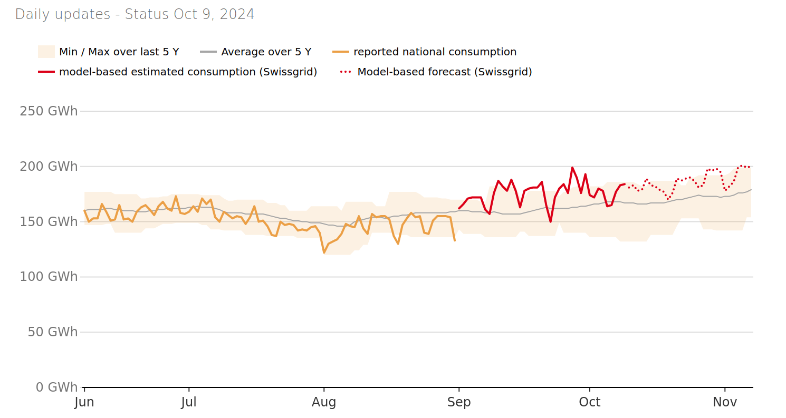

# :material-lightbulb-on: Motivation

## Why am I doing this?

I wanted to have a place where I could showcase an end-to-end machine learning (ML) use-case.
Beyond the methodologies -- and tools involved -- I wanted to centralize some pieces of advice, as not to lose sight of them.
None of them should be taken as gospel -- as I am still early in my career -- nor should they be seen as set-in-stone rules; they are more like flexible guidelines to help navigate an ML use-case from start to finish.

Eventually, I stumbled upon the [Swiss Energy Dashboard](https://energiedashboard.admin.ch/strom/stromverbrauch), made available by the Swiss Federal Office of Energy (SFOE). I figured it would make for an interesting use-case dealing with real-world data.

<figure markdown="span">
  { width="100%" }
  <figcaption>Electricity consumption plot from the Swiss Energy Dashboard</figcaption>
</figure>

## ML project's stages

Most ML projects can be roughly broken down into sequential stages:

1. **Problem understanding**: What problem are we trying to solve? In what context? 
2. **Data ingestion**: What data can we access to solve this problem? How?
3. **Exploratory Data Analysis (EDA)**: What does that data look like?
4. **Modelling**: How can we use that data to solve our problem?
5. **Industrialization**: How can we prepare our solution for it to be used by other people?
6. **Deployment**: How can the people having the initial problem use our solution? 

We will proceed stage by stage, but _very often_ go back to previous stages, due to the **iterative nature of ML engineering**.[^1]

[^1]: The write-up of this side-project might give the impression of working through each stage methodically, closing one off before moving onto the next one. This is only an appearance.

!!! tip "ML engineering is an iterative process."
    We start our ML journey at the first stage and work our way towards the last. 
    Each stage highlights opportunities -- and flaws -- in the previous stages, leading us to go back and rework them.

    This iterative process is expected and a direct consequence of each problem's unique context.